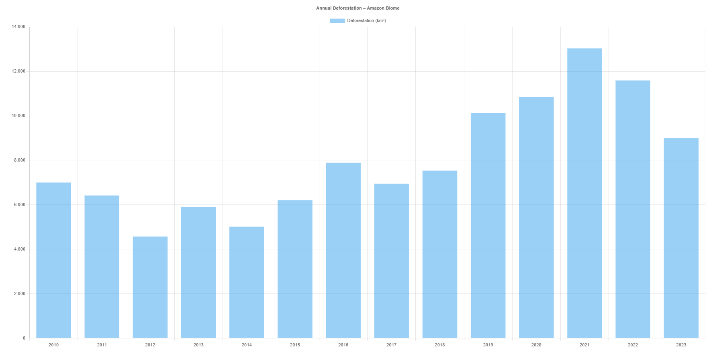
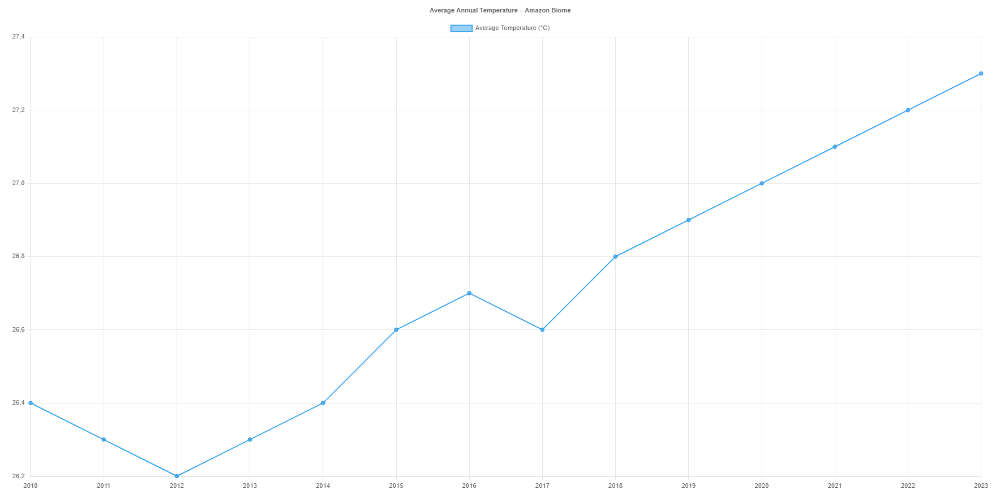

  <strong>
    <a href="./README.md">Português</a>
    &nbsp;|&nbsp;
    English
  </strong>

# Climate Data Platform — Amazon

[🌐 Visit the site](https://climate-data-platform-amazonia.vercel.app/)

## About the Project
This platform integrates and visualizes public climate change data, focusing on the Amazon biome. It provides interactive charts and reliable information to facilitate analysis and understanding of environmental impact.

## Features
- Interactive charts: **annual average temperature** and **annual deforestation**.
- Clean, responsive, and user-friendly interface.
- Reliable and up-to-date data sources.
- Hero section with a CTA button to explore data.

## Technologies
- HTML5
- CSS3
- JavaScript
- [Chart.js](https://www.chartjs.org/) for interactive charts
- Deployed on [Vercel](https://vercel.com/)

## Data Sources
- **Annual average temperature:** public consolidated climate data ([NOAA](https://www.noaa.gov/) / [World Bank](https://data.worldbank.org/))
- **Annual deforestation:** [INPE – PRODES Project (Legal Amazon)](http://www.obt.inpe.br/prodes/index.php)

## How to Use
1. Access the site: [https://climate-data-platform-amazonia.vercel.app/](https://climate-data-platform-amazonia.vercel.app/)  
2. Explore the interactive charts and data on temperature and deforestation.

## Project Screenshots

## Delivered Goal
This project demonstrates skills in:
- Integrating multiple public data sources
- Creating interactive visualizations
- Developing a responsive and professional website
- Presenting complex information clearly
